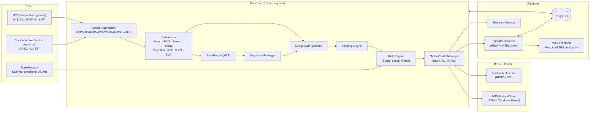

# Technische Spezifikation — „Mech Model" Trading-Bot & Plattform

| | |
|---|---|
| **Basis** | `docs/STRATEGY.md` (Schritt 1+2 abgeschlossen, alle Regeln vom Nutzer bestätigt) |
| **Status** | Schritt 3 abgeschlossen, Entscheidungen F1–F7 eingearbeitet — **wartet auf finale Freigabe (Schritt 4)** |
| **Märkte** | Micro-Risiko-Prinzip (R18): primär **NAS100/US100-CFD auf FTMO/MT5** (Signale auf den MT5-Kerzen, F3); **MNQ** via Tradovate optional, falls das Alpha-Futures-Konto API-Zugang behält (F7) |
| **Konten** | **FTMO über MetaTrader 5 (primär)**; Tradovate optional (F7) |

---

## Inhalt

1. [Ziel & Scope](#1-ziel--scope)
2. [Systemarchitektur](#2-systemarchitektur)
3. [Technologie-Stack](#3-technologie-stack)
4. [Strategie-Engine](#4-strategie-engine)
5. [Punktesystem (Scoring)](#5-punktesystem-scoring)
6. [Risk Engine](#6-risk-engine)
7. [Broker-Adapter](#7-broker-adapter)
8. [Session- & News-Filter](#8-session--news-filter)
9. [Benachrichtigungen](#9-benachrichtigungen)
10. [Web-Plattform](#10-web-plattform)
11. [Persistenz, Recovery & Fehlerbehandlung](#11-persistenz-recovery--fehlerbehandlung)
12. [Logging & Trade-Journal](#12-logging--trade-journal)
13. [Konfigurationsparameter](#13-konfigurationsparameter)
14. [Backtesting](#14-backtesting)
15. [Projektstruktur](#15-projektstruktur)
16. [Umsetzungsplan (Meilensteine)](#16-umsetzungsplan-meilensteine)
17. [Entscheidungen F1–F7](#17-entscheidungen-f1f7-beantwortet)

---

## 1. Ziel & Scope

Ein vollautomatischer Trading-Bot, der die 4-Schritte-Strategie aus
`STRATEGY.md` exakt umsetzt, plus eine abgesicherte Web-Plattform zur
Bedienung:

- Automatische Setup-Erkennung, Entry, SL, TP, Break-even.
- Positionsgröße aus einstellbarem Risiko; max. 1 offene Position
  (konfigurierbar); keine Doppel-Einstiege.
- Handel nur 9:30–11:00 ET (neue Entries), Tageslimits nach Strategie.
- Punktesystem als Qualitätsfilter (bestätigte Rangfolge aus STRATEGY §10).
- Konten: FTMO/MT5 (primär) und optional Tradovate, beide über eine
  Adapter-Schnittstelle (F7: Tradovate nur, falls das Alpha-Futures-Konto
  nach der Migration API-Zugang behält).
- Telegram-Benachrichtigung bei jedem Trade-Ereignis.
- Optionaler ForexFactory-News-Filter.
- Web-Oberfläche: HTTPS, Accounts nur per Referenzcode des Inhabers,
  Dashboard, Konfiguration, Trade-Journal.
- Vollständiges Logging, saubere Fehlerbehandlung, Weiterarbeit nach
  Neustart, Backtesting-Modul.

**Nicht im Scope (v1):** Forex-Paare, 30s-Timeframe als Default (nur als
Option), diskretionäre Video-Elemente (siehe STRATEGY §11), Ausführung
nach 11:00 ET, ES-basiertes Exit-Management.

---

## 2. Systemarchitektur



\* 30s nur bei aktivierter Option (aus Tick-Daten aggregiert).

**Grundprinzipien:**

- **Ein Engine-Kern, mehrere Konten:** Die Strategie-Engine ist
  broker-agnostisch; jedes verbundene Konto (Tradovate, FTMO/MT5) läuft
  als eigene „Bot-Instanz" mit eigener Konfiguration, gespeist aus dem
  passenden Daten-Feed.
- **Bar-Close-getrieben:** Alle Entscheidungen fallen auf Kerzenschluss
  des jeweiligen Timeframes (entspricht den Body-Close-Regeln der
  Strategie); keine Intrabar-Signale außer SL/TP/BE-Überwachung.
- **Alles persistiert:** Jeder Zustandsübergang (Bias, Level, Setup,
  Order) wird sofort in die DB geschrieben → Crash-Recovery (§11).

---

## 3. Technologie-Stack

| Komponente | Wahl | Begründung |
|---|---|---|
| Sprache Core/Backend | **Python 3.12** | Ökosystem für Trading/APIs, MetaTrader5-Package, gut testbar |
| Async-Runtime | asyncio + `websockets`/`aiohttp` | parallele Feeds, Ereignissteuerung |
| Web-Backend | **FastAPI** + Uvicorn | modern, typisiert, WebSocket-Support, OpenAPI |
| Frontend | **React + TypeScript** (Vite) | Dashboard mit Live-Updates |
| Datenbank | **PostgreSQL** (Dev: SQLite) via SQLAlchemy + Alembic | robust, Migrationen |
| TLS/Reverse-Proxy | **Caddy** | automatisches Let's Encrypt (HTTPS), HSTS, Rate-Limits |
| Telegram | `python-telegram-bot` | etabliert, async |
| MT5-Anbindung | offizielles `MetaTrader5`-Python-Package | einzige stabile MT5-API; läuft nur unter Windows → eigener Bridge-Dienst (§7.2) |
| Deployment | Docker Compose (Core, API, DB, Caddy); MT5-Bridge separat auf Windows-VPS | reproduzierbar |
| Tests | pytest (+ synthetische Kerzenserien, Golden-Tests aus den Video-Beispielen) | Verifikation der Detektoren |
| Logging | structlog (JSON) + DB-Trade-Journal | auswertbar |

---

## 4. Strategie-Engine

### 4.1 Daten-Pipeline

- Basis-Feed: 1m-Bars + Ticks aus MT5 (primär; F3 Option B) bzw. Ticks
  über die Tradovate-WS (optional). Aggregation zu
  allen benötigten Timeframes: 1m, 2m, 3m, 4m, 5m, 15m, 30m, 1H, 4H, D
  (+ 30s aus Ticks, nur wenn `use_30s = true`).
- Historie beim Start: genug Bars je TF laden (Daily ≥ 100, 4H/1H ≥ 300,
  LTF ≥ 500), damit Bias und Levels sofort berechenbar sind.
- Zeitzone: alle Session-Logik in `America/New_York` (DST-sicher via
  `zoneinfo`).
- Parallel-Feed des Vergleichsindex für SMT: auf MT5 der S&P-500-CFD
  desselben Brokers (z. B. `US500`), im Futures-Setup ES. Symbolnamen
  konfigurierbar.

### 4.2 Detektor-Module (reine Funktionen, einzeln testbar)

| Modul | Regel (Verweis STRATEGY.md) |
|---|---|
| `SwingDetector` | Fraktal `n = 1` (R1); markiert external/internal Swings §2.1 |
| `FVGDetector` | 3-Kerzen-Definition §2.3; pro TF; Zustand: frisch/mitigiert/missachtet (Body-Close durch Zone, R2) |
| `SweepDetector` | Wick-Durchstich genügt (R3) §2.4 |
| `IntermediateLevelDetector` | Swing-Punkte innerhalb einer FVG-Zone §2.5 |
| `CISDDetector` | Anker = Open der ersten Kerze der Down-/Up-Close-Serie, die das Level traf (R4); bestätigt durch Body-Close §2.6; Multi-TF-Abgleich |
| `RejectionBlockDetector` | Wick-Box + 50 %-Linie (R5) §2.7 |
| `IFVGDetector` | Inversion = Body-Close vollständig jenseits der fernen Gap-Kante (R6) §2.8 |
| `SMTDetector` | Divergenz NQ vs. ES an Referenz-Swings §2.10 |

### 4.3 Bias-Engine (Schritt 1 der Strategie)

- Läuft auf Daily/4H/1H (+15m-Check); Ergebnis: `BULLISH`, `BEARISH`
  oder `NEUTRAL` (kein Handel) + DOL-Level.
- Bewertung je TF: Welche FVGs werden respektiert/missachtet (R2-Regel)?
  Ergebnis konsistent über die TFs → Bias; Widerspruch → `NEUTRAL`.
- DOL: nächstes ungesweeptes externes Swing High/Low bzw. equal
  highs/lows oder unfilled Gap in Bias-Richtung (STRATEGY §11 D2).
- **Intraday-Neubewertung (R7):** Nach jedem 15m-Close wird der Bias neu
  berechnet; starke Rejections an Key Levels (lange Gegen-Wicks auf
  15m+) fließen als Warnsignal ein und können den Bias auf `NEUTRAL`
  setzen. Ein Bias-Wechsel schließt **keine** offene Position (R14),
  verhindert aber neue Entries in die alte Richtung.

### 4.4 Key-Level-Manager (Schritt 2)

- Kandidaten aus den Detektoren (Typ A FVG/Intermediate, Typ B CISD,
  Typ C Rejection Block) auf 3m/5m/15m/30m/1H/4H, gefiltert nach
  Bias-Richtung und Gültigkeit (K1–K8, inkl. Sweep-Regel K2).
- **Auswahl: maximal `max_key_levels` (Default 3)** — Priorisierung nach
  vorläufiger Punktzahl (§5), dann Nähe zum Preis.
- Invalidierung: Body-Close jenseits der Zone (R15) → Level entfernt.

### 4.5 Setup-State-Machine (Schritt 3 + 4)

Pro Bot-Instanz genau ein aktiver Zustand:

```
IDLE ──(Session offen, Bias ≠ NEUTRAL, Key Level vorhanden)──▶ ARMED
ARMED ──(Preis handelt in Key Level)──▶ TAPPED
TAPPED ──(Manipulation Leg fixiert; IFVG-Kandidaten im Leg gesucht)──▶ AWAITING_INVERSION
AWAITING_INVERSION ──(höchste TF-Inversion mit valid close
                      UND Score ≥ Schwelle UND Risk-Gates ok)──▶ ENTRY
ENTRY ──(Order gefüllt)──▶ MANAGING
MANAGING ──(BE-Trigger am Leg-Swing → SL auf Einstand)──▶ MANAGING
MANAGING ──(TP/SL/BE erreicht)──▶ CLOSED → Tageslimits prüfen → IDLE oder DONE_FOR_DAY
Jeder Zustand: Invalidierung (I1–I6) → zurück zu IDLE
```

Regeln im Detail:

- **Manipulation Leg:** letzter Swing (n=1) vor der Berührung des Key
  Levels bis zum Extrem der Berührung; Leg-Update, solange kein Entry
  (neues Extrem = Leg wächst). Konservative Variante (externes 5m-Leg)
  als Option `use_external_leg` (Default aus).
- **IFVG-Auswahl:** alle FVGs innerhalb des Legs auf 1m–5m (+30s bei
  Option); es zählt die Inversion des **höchsten** vorhandenen TF (C3–C6;
  R8: Option `allow_lower_tf_inversion`, Default aus).
- **Entry (E1/E2):** Market-Order beim Inversions-Close. Wenn dadurch
  `RR < rr_min` (1.0): stattdessen Limit-Order am IFVG bzw. CISD-Level
  (Preis = nähere Kante); Limit verfällt bei Level-Invalidierung oder
  Session-Ende (11:00 ET).
- **SL (S1):** Swing des Manipulation Legs ± `sl_buffer_ticks`
  (Default 0). Guard: Dollarrisiko des Trades > `max_trade_risk_usd`
  (1000 $, F1) → Setup verwerfen.
- **TP (T1–T3, R10):** Low-Hanging Fruit = nächstes Ziel in
  Trade-Richtung aus {unfilled 15m/1H-Gap, nächstes externes Swing,
  equal highs/lows}; wenn RR(Ziel) < 1.0 → TP auf exakt 1:1 hinter das
  Ziel; wenn RR(Ziel) > `rr_max` (3.0) → TP auf `rr_max` gedeckelt.
- **Break-even (BE1, R11):** Preis erreicht Leg-Swing → SL auf
  Einstandspreis (+ `be_offset_ticks`, Default 0). BE-Ausstopp zählt
  weder als Gewinn noch Verlust für die Tageslimits (Video: nach BE ggf.
  neues Setup am internen Level, BE3).
- **Kein Trailing** (R12); generisches Trailing als abschaltbares
  Zusatzfeature vorhanden, Default aus.
- **Tageslimits (F1–F5):** Zähler in DB: `wins`, `losses`, `trades`.
  1 Gewinn → `DONE_FOR_DAY`; 2 Verluste → `DONE_FOR_DAY`; nach
  1 Verlust nur weiter, wenn ein **neues** Key Level entsteht (BE3/F3);
  `max_trades_per_day` (2) hart. Keine Doppel-Einstiege: pro
  Setup-Instanz genau eine Order (idempotenter Client-Order-Key).

---

## 5. Punktesystem (Scoring)

Bestätigte Rangfolge (STRATEGY §10, R16). **Gates** sind Pflicht (kein
Trade ohne sie), **Punkte** quantifizieren die Zusatzqualität.

### 5.1 Gates (K.o.)

1. Bias ≠ NEUTRAL und Trade in Bias-Richtung
2. Gültiges Key Level getroffen
3. Inversion des höchsten TF-FVG im Manipulation Leg (valid close)
4. Session-Fenster 9:30–11:00 ET
5. Tageslimits/Risk-Limits nicht verletzt (inkl. `max_sl_distance`,
   News-Fenster falls aktiv)

### 5.2 Punktwerte (Default, alle einzeln konfigurierbar)

| Rang | Einfluss | Punkte |
|---|---|---|
| 1 | Alle Bias-TFs einig (Daily + 4H + 1H; 15m widerspricht nicht) | **20** |
| 2 | Key Level = FVG + CISD kombiniert | **18** |
| 3 | CISD auf ≥ 2 Timeframes gleichzeitig | **15** |
| 4 | SMT-Divergenz (NQ/ES) am Key Level | **12** |
| 5 | HTF-Sponsorship des Key Levels (Level an 1H/4H-Struktur) | **10** |
| 6 | Offensichtliches DOL in Trade-Richtung (unfilled 15m/1H-Gap oder equal highs/lows) | **8** |
| 7 | Key Level in Discount (Long) bzw. Premium (Short) der Range | **6** |
| 8 | Rejection Block zusätzlich am Level | **5** |
| 9 | Liquidity Sweep unmittelbar vor der Umkehr | **4** |
| 10 | Höchste Inversion ≥ 1m (kein reines 30s-Setup) | **2** |
| | **Maximal erreichbar** | **100** |

- **Trade-Schwelle:** `score_threshold` — **Default 40** (kalibrierbar
  per Backtest, §14). Gleiche Schwelle für Trade 2 nach Verlust (R13).
- Jeder Trade speichert seinen **Score-Breakdown** (welcher Einfluss wie
  viele Punkte gab) im Journal und in der Telegram-Nachricht.

---

## 6. Risk Engine

- **Positionsgröße:**
  `Kontrakte = floor((Equity × risk_per_trade_pct) / (SL_Distanz_Punkte × Punktwert))`
  MNQ: Punktwert 2 $/Punkt (Tick 0,25 = 0,50 $). Ergebnis < 1 Kontrakt →
  Setup übersprungen (Meldung „Risiko zu klein für 1 Kontrakt").
- **Limits (alle konfigurierbar, Prüfung vor jedem Entry):**
  - `max_concurrent_trades` (Default 1)
  - `max_trades_per_day` (Default 2)
  - `max_daily_loss_pct` (Default 2 %) — erreicht → `DONE_FOR_DAY`
  - `max_drawdown_pct` (Default 8 % vom Equity-Hoch) — erreicht →
    Bot-Stopp + Benachrichtigung (manuelles Re-Enable nötig)
  - `max_trade_risk_usd` (Default **1000 $**, F1): Gesamt-Dollarrisiko
    des Trades (SL-Distanz × Punkt-/Pipwert × Positionsgröße) darf
    1000 $ nicht überschreiten; liegt schon die Mindestgröße
    (1 Kontrakt bzw. kleinste Lot-Stufe) darüber, wird das Setup
    verworfen
- **Kill-Switch:** im Dashboard und per Telegram-Kommando `/stop` —
  keine neuen Entries; optional `/flat` schließt Positionen (nur Owner).
- FTMO-Besonderheit: Tages-Verlustlimit der Prop-Firm wird als
  zusätzlicher Parameter geführt (`prop_daily_loss_usd`), Prüfung
  inklusive offener P&L.

---

## 7. Broker-Adapter

Gemeinsames Interface `BrokerAdapter` (abstrakt):
`get_candles`, `stream_ticks`, `get_equity`, `get_positions`,
`get_orders`, `place_bracket_order(entry, sl, tp, qty, client_key)`,
`modify_sl`, `cancel_order`, `close_position`, Ereignis-Callbacks
(Fill, Reject, Disconnect).

### 7.1 FTMO via MT5-Bridge (primär)

- Das offizielle `MetaTrader5`-Python-Package läuft **nur unter Windows**
  mit installiertem, eingeloggtem MT5-Terminal (FTMO-Konto).
- Architektur: eigener **Bridge-Dienst** (`bridge_mt5/`) auf einem
  Windows-VPS; exponiert das `BrokerAdapter`-Interface als
  authentifizierte REST/WebSocket-API (nur über TLS + Token erreichbar);
  der Bot-Core spricht die Bridge wie jeden Adapter an.
- ✅ F3 (Option B): **Signale werden direkt auf den MT5-Kerzen des
  gehandelten CFDs berechnet** (z. B. `US100`) — Signal- und
  Ausführungschart sind identisch, keine Abweichungen. SMT über den
  Index-CFD desselben Brokers (z. B. `US500`).
- Instrument: FTMO/MT5 bietet keine echten MNQ-Futures, sondern
  Index-CFDs. Die Risk-Engine berechnet die Lot-Größe in den kleinsten
  Lot-Stufen so, dass das Dollar-Risiko dem Micro-Prinzip (R18)
  entspricht.

### 7.2 Tradovate (optional, F7)

- ⚠️ Der Nutzer handelt Alpha-Futures-„Zero"-Konten; nach deren
  Migration auf die eigene Alpha-Infrastruktur ist **unklar**, ob
  weiterhin Tradovate-API-Zugang + CME-Datenabo bestehen. → Vor der
  Umsetzung beim Alpha-Futures-Support klären; der Adapter wird erst
  gebaut, wenn der Zugang bestätigt ist (Meilenstein M6, optional).
- Technik (falls verfügbar): REST + WebSocket (Demo/Live), Auth per
  API-Key/OAuth; CME-Market-Data-Abo erforderlich; native Bracket-Order
  (Entry + OSO SL/TP); `client_key` = eigene Order-ID →
  Doppel-Einstieg-Schutz auch nach Reconnect; automatischer
  MNQ-Frontmonat-Rollover mit Telegram-Warnung.

---

## 8. Session- & News-Filter

- **Session (Z1/Z2, R14):** Neue Entries nur 9:30:00–10:59:59 ET
  (Parameter `session_start`/`session_end`). Offene Positionen laufen
  weiter; kein Zwangs-Flat. Handelskalender: nur CME-Handelstage
  (Feiertage über Kalendertabelle).
- **News-Filter (optional, kein Video-Bestandteil):** wöchentlicher
  Abruf des ForexFactory-Kalenders (JSON `ff_calendar_thisweek.json`,
  lokal gecacht). Bei `news_filter_enabled = true`: keine neuen Entries
  von `news_block_before_min` (Default 5) bis `news_block_after_min`
  (Default 5) Minuten um **High-Impact-USD-Events**; Impact-Stufen und
  Währungen konfigurierbar. Abruf-Fehler → Warnung, Bot handelt weiter
  (Fail-Open, konfigurierbar auf Fail-Closed).

---

## 9. Benachrichtigungen

- **Telegram (Primärkanal):** eigener Bot (Token vom Nutzer, §17/F5).
  Verknüpfung: Nutzer generiert im Web-Dashboard einen Einmalcode und
  sendet ihn dem Bot per `/start <code>` → Chat-ID wird dem Account
  zugeordnet.
- **Ereignisse (pro Nutzer an-/abschaltbar):**
  `ENTRY` (Symbol, Richtung, Preis, SL, TP, Kontrakte, RR,
  Score-Breakdown), `BREAK_EVEN`, `TP_HIT`, `SL_HIT`, `LIMIT_PLACED`/
  `LIMIT_CANCELLED`, `DONE_FOR_DAY`, `DAILY_REPORT` (nach 11:00),
  `ERROR`/`DISCONNECT`, `DRAWDOWN_STOP`, `ROLLOVER`.
- **Web-Dashboard:** gleicher Ereignis-Feed live per WebSocket.
- Erweiterbar (E-Mail, Discord) über dasselbe Notifier-Interface.

---

## 10. Web-Plattform

### 10.1 Sicherheit & Zugang

- **HTTPS erzwungen:** Caddy als Reverse Proxy, automatische
  Let's-Encrypt-Zertifikate, HTTP→HTTPS-Redirect, HSTS,
  Security-Header (CSP, X-Frame-Options), Rate-Limiting auf
  Auth-Endpunkten.
- **Registrierung nur mit Referenzcode:** Codes erzeugt ausschließlich
  die **Owner-Rolle** (einmalig verwendbar, Ablaufdatum, widerrufbar;
  Übersicht wer welchen Code eingelöst hat). Ohne gültigen Code kein
  Account.
- **Rollen:** `OWNER` (du): Codes verwalten, Nutzer sperren, globale
  Defaults, Kill-Switch für alle Instanzen; `USER`: eigenes Konto,
  eigene Bot-Konfiguration, eigene Broker-Verbindungen.
- **Auth:** Passwort-Hashing mit **Argon2id**; Sessions als signierte
  httpOnly-Secure-Cookies (SameSite=Lax) + CSRF-Schutz; optional TOTP-2FA
  (v2). Login-Audit-Log.
- **Broker-Credentials:** AES-GCM-verschlüsselt in der DB
  (Master-Key nur als Umgebungsvariable auf dem Server); nie im
  Klartext an das Frontend.

### 10.2 Funktionen

| Bereich | Inhalt |
|---|---|
| Dashboard | Bot-Status je Konto (IDLE/ARMED/…, aktueller Bias, Key Levels), offene Position, Live-Ereignis-Feed, Equity-Kurve |
| Trades | Journal mit Filtern; je Trade: alle Preise, Zeiten, Score-Breakdown, Regel-Referenzen |
| Konfiguration | alle Parameter aus §13 (Formular mit Validierung); Änderungen greifen ab dem nächsten Setup, nie in laufende Trades |
| Broker | Tradovate-/MT5-Bridge-Verbindung einrichten & testen |
| Benachrichtigungen | Telegram verknüpfen, Ereignisse wählen |
| Admin (nur Owner) | Referenzcodes, Nutzerliste, globaler Kill-Switch |

---

## 11. Persistenz, Recovery & Fehlerbehandlung

- **DB-Tabellen (Kern):** `users`, `invite_codes`, `broker_accounts`,
  `bot_instances`, `bot_configs` (versioniert), `bias_snapshots`,
  `key_levels`, `setups` (State-Machine-Zustand), `orders`, `trades`,
  `daily_counters`, `events`, `audit_log`, `news_events`,
  `notifications`.
- **Recovery nach Neustart:** Beim Start lädt jede Bot-Instanz ihren
  letzten Zustand aus der DB und **rekonsiliert gegen den Broker**
  (offene Positionen/Orders sind die Wahrheit): Position offen → direkt
  in `MANAGING` (SL/TP/BE-Überwachung läuft weiter); offenes Limit →
  `AWAITING_INVERSION`-Kontext wiederherstellen oder Limit stornieren,
  wenn Kontext invalide; Kerzenhistorie wird nachgeladen.
  Doppel-Einstieg-Schutz über idempotente `client_key`s.
- **Fehlerbehandlung:** API-Fehler → Retry mit exponentiellem Backoff
  (2/4/8/16 s, max. 4); WS-Disconnect → Auto-Reconnect + Nachladen
  verpasster Bars; wiederholte Fehler → **Safe-Mode** (keine neuen
  Entries, bestehende SL/TP bleiben beim Broker aktiv) + Telegram-Alarm.
  Order-Reject → Setup abbrechen, Ereignis loggen, keine automatische
  Wiederholung desselben Entries (I4).
- Alle Zeiten in UTC gespeichert, Anzeige in ET/lokal.

---

## 12. Logging & Trade-Journal

- **Strukturierte Logs (JSON):** jede Entscheidung mit Kontext
  (Bias-Berechnung, Level-Erstellung/-Invalidierung, Score, Gates,
  Orders, Fehler); Log-Level konfigurierbar; Rotation.
- **Trade-Journal (DB):** pro Trade: Setup-Typ, alle Level (Key Level,
  Leg, IFVG-TF), Entry/SL/TP/Exit mit Zeitstempeln, Kontrakte, Risiko $,
  Ergebnis R und $, Score-Breakdown, Konto. Export als CSV im Dashboard
  (Tradezella-kompatibel).

---

## 13. Konfigurationsparameter

Alle pro Bot-Instanz einstellbar (Web-UI), mit Validierung und
Versionierung. Defaults:

| Parameter | Default | Bedeutung |
|---|---|---|
| `markets` | `["US100"]` (MT5) bzw. `["MNQ"]` (Tradovate) | Micro-Risiko-Prinzip (R18/F7); Symbol je Konto konfigurierbar |
| `risk_per_trade_pct` | `1.0` | Risiko pro Trade in % vom Equity |
| `rr_min` / `rr_max` | `1.0` / `3.0` | RR-Fenster (T1) |
| `score_threshold` | `40` | Mindestpunktzahl (§5) |
| `score_weights` | §5.2 | alle 10 Gewichte einzeln |
| `session_start` / `session_end` | `09:30` / `11:00` ET | Entry-Fenster (Z1) |
| `max_trades_per_day` | `2` | F1 |
| `stop_after_win` | `true` | F2 |
| `stop_after_losses` | `2` | F4 |
| `max_daily_loss_pct` | `2.0` | Tagesverlust-Limit |
| `max_drawdown_pct` | `8.0` | Drawdown-Stopp |
| `prop_daily_loss_usd` | `null` | zusätzliches FTMO-Limit |
| `max_concurrent_trades` | `1` | gleichzeitige Positionen |
| `max_key_levels` | `3` | §4.4 |
| `bias_timeframes` | `["D","4H","1H"]` (+`15m`-Check) | §4.3 |
| `keylevel_timeframes` | `["3m","5m","15m","30m","1H","4H"]` | §4.4 |
| `entry_timeframes` | `["1m","2m","3m","4m","5m"]` | §4.5 |
| `use_30s` | `false` | 30s-IFVG (D7) |
| `allow_lower_tf_inversion` | `false` | R8-Option |
| `use_external_leg` | `false` | konservative Leg-Variante (C7) |
| `sl_mode` | `"swing"` | S1; Alternativen `body`/`fvg` |
| `sl_buffer_ticks` / `be_offset_ticks` | `0` / `0` | Feinjustierung |
| `max_trade_risk_usd` | `1000` | F1: maximales Dollar-Risiko pro Trade |
| `breakeven_enabled` | `true` | BE1 (R11) |
| `trailing_enabled` | `false` | generisch, kein Strategie-Teil (R12) |
| `news_filter_enabled` | `false` | §8 |
| `news_block_before_min` / `after_min` | `5` / `5` | News-Fenster |
| `news_min_impact` / `news_currencies` | `high` / `["USD"]` | News-Kriterien |
| `notify_events` | alle an | §9 |

---

## 14. Backtesting

- Gleiche Engine, gespeist aus historischen 1m-Daten (+ Ticks für 30s,
  optional); Fill-Simulation: Entry am Close der Signalkerze,
  SL/TP-Prüfung per High/Low (konservativ: SL vor TP bei Berührung
  beider in einer Kerze).
- Metriken: Winrate, Profit-Faktor, Ø R, max. Drawdown, Ergebnisse je
  Score-Band (kalibriert `score_threshold` und die Gewichte),
  Verteilung nach Uhrzeit/Wochentag.
- Datenquelle (✅ F4): hochwertiger externer Datenanbieter für die
  1m-Historie (Budget vom Nutzer freigegeben) + CSV-Import; danach
  Validierung unter realen MT5-Bedingungen (Spread/Kommission des
  FTMO-Kontos, Forward-Test auf Demo).
- Video-Homework als Feature: „1 Woche pro Tag" replayen; Export ins
  Journal.

---

## 15. Projektstruktur

```
Forex/
├── docs/               # STRATEGY.md, SPEC.md
├── bot/
│   ├── core/           # Engine, State-Machine, Events
│   ├── detectors/      # swing.py, fvg.py, sweep.py, cisd.py,
│   │                   # rejection_block.py, ifvg.py, smt.py
│   ├── bias/           # Bias-Engine, DOL
│   ├── levels/         # Key-Level-Manager
│   ├── scoring/        # Gewichte, Breakdown
│   ├── risk/           # Sizing, Limits, Kill-Switch
│   ├── execution/      # Order-/Trade-Manager, BE-Logik
│   ├── brokers/        # base.py, tradovate/, mt5_client/
│   ├── data/           # Feeds, Aggregation, Historie
│   ├── filters/        # session.py, news.py
│   ├── notify/         # telegram.py, base.py
│   └── persistence/    # Models, Repositories, Recovery
├── bridge_mt5/         # Windows-Dienst (FTMO/MT5)
├── web/
│   ├── api/            # FastAPI (Auth, Codes, Config, Journal, WS)
│   └── frontend/       # React + TS
├── backtest/           # Runner, Fill-Simulator, Reports
├── tests/              # Unit (Detektoren!), Integration, Golden-Tests
├── docker-compose.yml
└── README.md
```

---

## 16. Umsetzungsplan (Meilensteine)

| # | Meilenstein | Inhalt | Ergebnis/Abnahme |
|---|---|---|---|
| M1 | Fundament | Projektgerüst, Config-System, DB-Schema, Logging | Repo läuft lokal, Tests grün |
| M2 | Detektoren | Alle Module aus §4.2 + Unit-Tests mit synthetischen Kerzen; Golden-Tests, die die 3 Video-Beispiele nachstellen | Detektoren nachweislich regelkonform |
| M3 | Strategie | Bias-Engine, Key-Level-Manager, State-Machine, Scoring, Session-Filter — im Paper-Modus (Simulations-Broker) | Bot erzeugt Signale auf Live-Daten ohne echte Orders |
| M4 | Backtester | §14 komplett; Kalibrierung von `score_threshold` | Backtest-Report über mehrere Wochen MNQ |
| M5 | FTMO/MT5 (primär) | Bridge-Dienst + Adapter, Risk-Engine, Order-Management, Recovery — **zuerst FTMO-Free-Trial/Demo** | Kompletter Trade-Zyklus auf FTMO-Demo |
| M6 | Tradovate (optional) | Adapter nur, falls Alpha-Futures den API-Zugang bestätigt (F7) | Trade-Zyklus auf Tradovate-Demo |
| M7 | Plattform | Web (Auth, Referenzcodes, Dashboard, Config), Telegram, News-Filter, Deployment (Docker + Caddy/HTTPS) | Ende-zu-Ende-Abnahme durch dich |

Reihenfolge fix; nach jedem Meilenstein kurzer Zwischenbericht.
**Live-Schaltung auf echtem Geld erst nach deiner ausdrücklichen
Bestätigung nach erfolgreicher Demo-Phase.**

---

## 17. Entscheidungen F1–F7 (beantwortet)

| # | Entscheidung |
|---|---|
| F1 | ✅ SL-Obergrenze = **1000 $ Gesamt-Dollarrisiko** pro Trade (`max_trade_risk_usd`) |
| F2 | ✅ Risiko-Default **1 %** pro Trade |
| F3 | ✅ **Option B**: Signale direkt auf den MT5-CFD-Kerzen des gehandelten Instruments |
| F4 | ✅ Budget für hochwertigen Datenanbieter (1m-Historie) freigegeben; danach Validierung unter MT5-Bedingungen |
| F5 | ✅ Nutzer erstellt den Telegram-Bot selbst — Schritt-für-Schritt-Anleitung: `docs/ANLEITUNG_TELEGRAM.md` |
| F6 | ✅ Noch kein Server/keine Domain vorhanden. Das **Mieten** (Konto + Zahlung beim Anbieter) kann nur der Nutzer selbst erledigen — dafür gibt es die einfache Kauf-Anleitung `docs/ANLEITUNG_SERVER.md`; die **komplette technische Einrichtung** danach liefert das Projekt fertig automatisiert (Docker + Setup-Skripte, M7: Copy-Paste von 2–3 Befehlen). |
| F7 | ⚠️ Alpha-Futures-„Zero"-Konten nach Migration evtl. ohne Tradovate-API → **FTMO/MT5 ist der primäre Weg** (M5); Tradovate-Adapter nur nach Bestätigung durch den Alpha-Futures-Support (M6, optional). |

---

*Alle Entscheidungen liegen vor. Nach der finalen Freigabe des Nutzers
beginnt Schritt 4: Implementierung nach Meilensteinplan §16, beginnend
mit M1+M2.*
