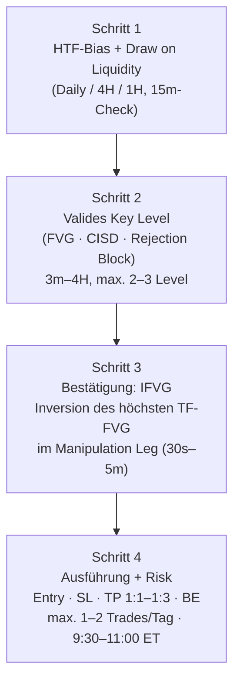

# PB Blake — „Updated Mech Model" (2026) — Strategie-Dokumentation

| | |
|---|---|
| **Quelle** | Video „My NEW UPDATED Trading Strategy for 2026 (70% Winrate)" von PB Blake (youtube.com/watch?v=9O6JU5_xTd8), vollständiges Transkript vom Nutzer bereitgestellt |
| **Status** | Schritt 1 abgeschlossen — **wartet auf Review durch den Nutzer (Schritt 2)** |
| **Grundsatz** | Es wurden **keine Regeln erfunden**. Alles, was das Video nicht hergibt, ist markiert: ❓ = offene Rückfrage, 🔧 = Definitionsvorschlag zur Automatisierung (nicht wörtlich aus dem Video, muss bestätigt werden), 🚫 = im Video nicht enthalten |
| **Sprache** | Deutsch; Fachbegriffe bleiben englisch (FVG, CISD, IFVG, …) |

---

## Inhaltsverzeichnis

1. [Überblick](#1-überblick)
2. [Begriffsdefinitionen](#2-begriffsdefinitionen)
3. [Schritt 1 — Higher-Timeframe-Bias & Draw on Liquidity](#3-schritt-1--higher-timeframe-bias--draw-on-liquidity)
4. [Schritt 2 — Valides Key Level](#4-schritt-2--valides-key-level)
5. [Schritt 3 — IFVG-Bestätigung](#5-schritt-3--ifvg-bestätigung)
6. [Schritt 4 — Ausführung & Risikomanagement](#6-schritt-4--ausführung--risikomanagement)
7. [Komplette Regelketten Long & Short](#7-komplette-regelketten-long--short)
8. [Invalidierungsregeln & Verbote](#8-invalidierungsregeln--verbote)
9. [Die drei Live-Trade-Beispiele aus dem Video](#9-die-drei-live-trade-beispiele-aus-dem-video)
10. [Wichtigkeit der Einflüsse (Basis für das Punktesystem)](#10-wichtigkeit-der-einflüsse-basis-für-das-punktesystem)
11. [Nicht eindeutig automatisierbare Stellen](#11-nicht-eindeutig-automatisierbare-stellen)
12. [Angeforderte Themen ohne Grundlage im Video](#12-angeforderte-themen-ohne-grundlage-im-video)
13. [Mapping auf die angeforderten Doku-Abschnitte](#13-mapping-auf-die-angeforderten-doku-abschnitte)
14. [Offene Rückfragen (Checkliste für Schritt 2)](#14-offene-rückfragen-checkliste-für-schritt-2)

---

## 1. Überblick

Die Strategie ist ein **4-Schritte-Modell** („Mech Model"), das jeden Trade
mechanisch aus denselben Bausteinen ableitet:

| Eckdaten laut Video | Wert |
|---|---|
| Behauptete Winrate | ~70 % |
| Chance-Risiko-Verhältnis (RR) | 1:1 bis 1:3 („low-hanging fruit") |
| Gehandelter Markt | NQ (Nasdaq-Futures); ES (S&P-Futures) läuft als Vergleichs-Chart für SMT mit |
| Handelsfenster | **9:30–11:00 Uhr Eastern Time** (vom Nutzer bestätigt; im Transkript waren die Uhrzeiten unleserlich). Ausführungen nach 11:00 sind laut Video „very, very rare" |
| Trades pro Tag | 1–2 (Details in §6.6) |
| Bias-Timeframes | Daily, 4H, 1H (+ 15m-Gegencheck) |
| Key-Level-Timeframes | 3m, 5m, 15m, 30m, 1H, 4H |
| Entry-Timeframes (IFVG) | 1m, 2m, 3m, 4m, 5m (+ 30s nur für Fortgeschrittene) |

**Kernphilosophie laut Video:**
> „The whole point of the strategy is that it removes the decision-making at
> the time of execution." — Konsistenz kommt aus Wiederholung, nicht aus
> Vorhersage. Kein Improvisieren, keine Stop-Verschiebung, kein Nachkaufen,
> kein sofortiger Re-Entry nach Stop-out.

Das macht die Strategie grundsätzlich gut automatisierbar — mit den in §11
markierten Ausnahmen.

---

## 2. Begriffsdefinitionen

Alle Definitionen sind so formuliert, dass sie ein Programm prüfen kann.
Wo das Video keine exakte Formel liefert, steht 🔧 mit einem Vorschlag.

### 2.1 Swing High / Swing Low

Das Video benutzt Swing-Punkte durchgehend, definiert sie aber nie formal. 🔧
**Vorschlag:** Ein Swing High ist eine Kerze, deren Hoch höher ist als die
Hochs der `n` Kerzen links und rechts (Standard-Fraktal, `n` konfigurierbar,
z. B. `n = 1` oder `n = 2`). Swing Low spiegelbildlich.
❓ *Rückfrage R1: `n` bestätigen (Vorschlag: n = 1 für „jede lokale
Struktur", wie es Blakes Chart-Beispielen entspricht).*

- **External Swing:** der äußere (größere) Swing-Punkt einer Bewegung —
  im Video z. B. „this external swing low on the 5-minute".
- **Internal/Intermediate:** Struktur *innerhalb* einer größeren Bewegung
  bzw. innerhalb eines FVG (siehe 2.5).

### 2.2 Marktstruktur & Trend

Das Video bestimmt den Trend **nicht** über klassische
Struktur-Sequenzen (HH/HL bzw. LH/LL) oder BOS/CHoCH-Labels, sondern über
zwei Fragen (siehe §3):

1. Welche FVGs werden respektiert vs. missachtet?
2. Auf welches offensichtliche Swing High/Low läuft der Markt zu?

> „Trade with the trend. The trend is your friend."

Zusatzregel aus dem Video: An Allzeithochs ist der Bias „extremely bullish";
Shorts nur bei „such an obvious bearish bias".

### 2.3 Fair Value Gap (FVG)

Das Video setzt den Begriff als bekannt voraus. 🔧 **Standard-Definition
(3-Kerzen-Muster), zur Bestätigung:**

- **Bullisches FVG:** Lücke zwischen `High(Kerze 1)` und `Low(Kerze 3)`,
  wenn `Low(Kerze 3) > High(Kerze 1)` (Aufwärts-Impuls; Kerze 2 überspringt
  den Bereich). Zone = `[High(K1), Low(K3)]`.
- **Bärisches FVG:** Lücke zwischen `Low(Kerze 1)` und `High(Kerze 3)`,
  wenn `High(Kerze 3) < Low(Kerze 1)`. Zone = `[High(K3), Low(K1)]`.

FVGs existieren auf jedem Timeframe und werden mit ihrem Timeframe benannt
(„5-minute gap", „hourly gap", „4-hour gap").

**Respektieren vs. Missachten** (zentral für den Bias, §3): 🔧 Vorschlag —
- *Respektiert:* Preis handelt in die Zone und dreht, **ohne** dass eine
  Kerze per **Body-Close** vollständig durch die Zone schließt
  (Video: „we are holding them").
- *Missachtet/disrespected:* eine Kerze schließt per Body vollständig
  durch die Zone hindurch (Video: „getting ran through … closing through
  them").
❓ *Rückfrage R2: Diese Body-Close-Definition bestätigen (Wick-Durchstich
allein = noch respektiert?).*

**Mitigiert / unmitigiert:**
- *Unmitigiert („unfilled"):* Preis hat die Zone seit Entstehung nicht
  wieder berührt. Unfilled Gaps sind laut Video „great draws" (gute Ziele).
- *Mitigiert:* Preis hat bereits in die Zone gehandelt (z. B. im
  Pre-Market). Ein bereits mitigiertes FVG ist **nicht mehr direkt** als
  Key Level verwendbar — siehe Sweep-Regel in §4.2.

### 2.4 Liquidity & Liquidity Sweep

Aus dem Video:
- **Buy-Side Liquidity:** über Hochs (Stops von Shorts) — z. B. „relative
  equal highs" = mehrere etwa gleiche Hochs; im Video als Tagesziel markiert.
- **Sell-Side Liquidity:** unter Tiefs — im Video „sell-side liquidity
  pool", der abgeholt wird, bevor es dreht.
- **Sweep:** Preis handelt **über** ein Hoch / **unter** ein Tief (nimmt
  die Liquidität) und kehrt zurück. Im Video u. a.: das Intermediate Low im
  FVG wird „swept out", ES „sweeps it out" beim SMT.
- **Low Resistance Liquidity:** gestapelte, leicht erreichbare Liquidität —
  im Video nur im Kontext der Break-even-Platzierung erwähnt (§6.5).

🔧 *Automatisierbar:* Sweep = `High > Referenz-High` (bzw. `Low <
Referenz-Low`) mit anschließender Rückkehr unter/über die Referenz.
❓ *Rückfrage R3: Muss die Sweep-Kerze zurückschließen (Close wieder
unter dem alten Hoch), oder zählt der reine Durchstich?*

### 2.5 Intermediate High / Intermediate Low „inside the gap"

Ein Swing-Hoch/-Tief, das **innerhalb der Zone eines FVG** liegt (der
Swing-Punkt ruht „inside of the gap"). Diese Levels sind eigenständige
Key-Level-Kandidaten (§4.2) und laut Video besonders hochwertig, wenn sie
nahe der Range-Mitte (EQ) bzw. im Discount liegen (Beispiel 1, §9.1).

### 2.6 CISD — Change In State of Delivery

**Wörtlich aus dem Video abgeleitet:**

- **Bullischer CISD:** Ein **Body-Close über** dem **Opening-Preis** einer
  Kerze oder Serie von **Down-Close-Kerzen** (rote Kerzen in Folge), die in
  ein FVG **oder** ein Intermediate Low innerhalb eines FVG gehandelt hat.
- **Bärischer CISD:** Ein **Body-Close unter** dem **Opening-Preis** einer
  Kerze oder Serie von **Up-Close-Kerzen**, die in ein FVG **oder** ein
  Intermediate High innerhalb eines FVG gehandelt hat.

Ablauf (bullisch): Down-Close-Serie trifft das Key Level → Opening-Preis
des **ersten** Down-Close-Kerzenkörpers dieser Serie markieren → sobald eine
Kerze per Body darüber schließt, ist der CISD bestätigt. Die markierte
Linie/Zone dient danach selbst als Key Level: „price ends up trading back
into that area, perfectly rejecting it".

🔧 *Präzisierung nötig:* „Opening-Preis der Serie" = Open der ersten Kerze
der zusammenhängenden Down-Close-Serie, die das Level erreicht hat.
❓ *Rückfrage R4: bestätigen (ggf. mit einem Screenshot verifizieren).*

**Verstärkung laut Video:**
- CISD **kombiniert mit FVG** ist „that much stronger" als ein CISD allein
  (allein verwendbar, aber schwächer).
- Tritt der CISD auf **mehreren Timeframes gleichzeitig** auf (Beispiel:
  15m + 5m + 1H), ist das „super high probability".

### 2.7 Rejection Block / Rejection Wick

**Wörtlich aus dem Video abgeleitet:**

- **Bullischer Rejection Block:** Der **Docht (Wick)** einer bullischen
  Reaktionskerze, der in ein FVG oder ein Intermediate Low innerhalb eines
  FVG gehandelt hat. Als Box vom Kerzenkörper-Tief bis zum Wick-Tief
  markieren.
- **Bärischer Rejection Block:** spiegelbildlich — Wick einer bärischen
  Kerze in ein FVG / Intermediate High.

Zusatzregel: **„draw out C of the range"** — die Mitte (50 %) der
Wick-Range mit einbeziehen, „a lot of times we can go to it and that's how
you really get those bottom tick entries".
🔧 *Interpretation:* „C" = Consequent Encroachment = 50 %-Linie des Wicks.
❓ *Rückfrage R5: bestätigen, dass die 50 %-Linie des Wicks gemeint ist.*

Der Rejection Block ist ein Key Level — kein Entry-Signal: „I'm not
entering at these levels … I'm going to wait for confirmation."

### 2.8 IFVG — Inversion Fair Value Gap

Ein FVG, durch das der Preis per **Body-Close** hindurchschließt und das
dadurch die Rolle wechselt (Support ↔ Resistance):

- **Bullische Inversion:** Kerze schließt per Body **über** einem
  **bärischen** FVG → Long-Trigger.
- **Bärische Inversion:** Kerze schließt per Body **unter** einem
  **bullischen** FVG → Short-Trigger.

Blake wartet auf einen „**valid close**" / „good close" — er lässt schwache
Closes aus („Wait, wait, wait. Still waiting for a good close").
❓ *Rückfrage R6: „valid close" algorithmisch fassen — Vorschlag: Body-Close
vollständig jenseits der fernen FVG-Kante; optional Mindestabstand in
Ticks/Prozent. Bestätigen oder präzisieren.*

### 2.9 Manipulation Leg

**Wörtlich:** „The manipulation leg is simply the swing high to the swing
low that hit your key level" (bullischer Fall; bärisch: Swing Low → Swing
High, das das Key Level getroffen hat).

Die **IFVG-Suche findet ausschließlich innerhalb dieses Legs statt** —
FVGs oberhalb/außerhalb des Legs sind irrelevant: „you just have to be
paying attention to the manipulation leg that hit your key level".

**Konservative Variante** (mehr Bestätigung, aus dem bärischen Beispiel):
statt des inneren Legs das **gesamte externe Leg** betrachten (externes
Swing Low → externes Swing High auf dem 5m) und dessen höchste
TF-Inversion abwarten.

### 2.10 SMT — Smart Money Technique / Divergenz (NQ vs. ES)

Aus den Video-Beispielen:
- **Bullische SMT:** ES sweept ein relevantes Tief, NQ **nicht** (oder
  umgekehrt) → Stärkesignal für Longs am Level.
- **Bärische SMT:** ein Index nimmt das Hoch, der andere nicht (Beispiel 3:
  ES nimmt das Hoch bei „955", danach bearish SMT am Swing High).

Verwendung im Video: **Konfluenz/Verstärkung** am Key Level und als
Exit-Hinweis — keine eigenständige Einstiegsbedingung.

### 2.11 Draw on Liquidity (DOL)

Das Tagesziel des Marktes: das **offensichtlichste** Swing High/Low bzw.
Liquiditätspool (equal highs/lows) oder **unfilled Gap** in Bias-Richtung.
„Unfilled gaps are great draws." Auf dem HTF für den Bias (§3), auf dem LTF
als Take-Profit-Ziel („low-hanging fruit", §6.4).

### 2.12 EQ / Premium / Discount

Im Video nur als Qualitätsmerkmal erwähnt: Das Intermediate Low in
Beispiel 1 war attraktiv, weil es „around EQ of this range" lag („below
discount" — unterhalb der Range-Mitte). 🔧 EQ = 50 % einer markierten
Range; Discount = untere Hälfte (für Longs günstig), Premium = obere
Hälfte (für Shorts günstig). **Mehr sagt das Video dazu nicht** — es gibt
keine Fibonacci-Level-Regeln (§12).

### 2.13 Sonstige im Video erwähnte Begriffe

- **Unfilled Gap:** noch nicht gefülltes FVG (15m/1H) — bevorzugtes TP-Ziel.
- **NWOG (New Week Opening Gap):** einmal erwähnt — ein Hoch war als Ziel
  unattraktiv, weil es zuvor in ein NWOG gehandelt hatte (Beispiel 3).
  Keine weitere Regel dazu im Video.
- **PDA (Premise/Price Delivery Array):** einmal pauschal erwähnt
  („respecting a lot of bearish PDAs") — Sammelbegriff für Levels wie FVGs.

---

## 3. Schritt 1 — Higher-Timeframe-Bias & Draw on Liquidity

**Zweck laut Video:** „fixes win rate more than anything else"; wer Bias
richtig bestimmt, hat „about 90 % of the bad trades" eliminiert.

**Timeframes:** Daily, 4H, 1H als Hauptquellen („sticking with those hourly
time frames gives me the clearest picture"); zur Markteröffnung zusätzlich
**15m-Gegencheck** — z. B. können „perfect equal lows" auf dem 15m den Bias
ändern.

### Regeln

| # | Regel | Quelle (Transkript) |
|---|---|---|
| B1 | Beantworte Frage 1: **Welche FVGs respektiert der Markt, welche missachtet er?** Bullischer Bias ⇔ bullische FVGs werden respektiert **und** bärische FVGs missachtet. Bärischer Bias ⇔ umgekehrt. | „What fair value gaps are we respecting versus disrespecting?" |
| B2 | Beantworte Frage 2: **Auf welches offensichtliche Swing High/Low läuft der Markt zu?** Dieses Level ist das Draw on Liquidity (DOL) des Tages. | „What swing high or low are we going towards? … you mark it out and that's your draw on liquidity for the day" |
| B3 | Bias und DOL müssen zusammenpassen: bullischer Bias → DOL ist ein Hoch (Buy-Side); bärischer Bias → DOL ist ein Tief. | Beispiele im Video |
| B4 | **Mit dem Trend handeln.** An Allzeithochs: nur Longs; Shorts nur bei „such an obvious bearish bias". | „Trade with the trend … at all-time highs … literally just taking longs" |
| B5 | Optionaler Zusatzcheck: **ES** (zweiter Index) sollte „relatively the same thing" tun; equal highs dort verstärken das DOL. | Beispiel 13. Mai |
| B6 | Der Bias wird **vor** der Session bestimmt (im Video: Analyse „at around … a.m." vor Open) und gilt für den Tag; der 15m-Check zur Eröffnung kann ihn kippen (→ ❓ R7: darf der Bot den Bias intraday neu bewerten oder ist er für den Tag fix?). | „this is the chart that I was looking at at around a.m." |

### Beispiel aus dem Video (Mittwoch, 13. Mai)

Daily: Allzeithoch → „extremely bullish". 4H: bullisches 4H-FVG wird
respektiert. 1H: bärische FVGs links werden „ran through" (missachtet),
bullische FVGs halten. ES bestätigt. Über dem Markt: **relative equal
highs** → Buy-Side-Liquidität = DOL des Tages. Ergebnis: bullischer Bias
Richtung equal highs; Blake machte an dem Tag ~11 000 $ „literally just
because I was following the higher time frame trend".

---

## 4. Schritt 2 — Valides Key Level

**Zweck:** Der eine hochwertige Bereich, an dem der Trade entsteht — oder
an dem die Idee stirbt: „a high quality point in which price will either
reverse from or your bias is just completely wrong."

**Timeframes:** 3m, 5m, 15m, 30m, 1H, 4H — immer **mit** HTF-Narrativ aus
Schritt 1. **Maximal 2–3 Key Levels pro Tag** („by giving yourself these
two to three levels, that is all you're going to need") — nicht 20 Linien
und 30 Indikatoren.

### 4.1 Die drei Key-Level-Typen

| Typ | Definition | Verwendung |
|---|---|---|
| **A — FVG** | Unmitigiertes FVG **oder** Intermediate High/Low innerhalb eines FVG (2.3/2.5) | Klassisches Level: Preis handelt hinein → Reaktion erwartet |
| **B — CISD** | Level aus bestätigtem Change In State of Delivery (2.6) | Als Retest-Level („trading back into that area, perfectly rejecting it"); am stärksten **in Kombination mit** FVG |
| **C — Rejection Block** | Wick-Box einer Reaktionskerze in ein FVG (2.7), inkl. 50 %-Linie | Retest-Level für Präzisionseinstiege („bottom tick entries") |

### 4.2 Gültigkeitsregeln

| # | Regel | Quelle |
|---|---|---|
| K1 | Ein **frisches (unmitigiertes) FVG** ist direkt als Key Level gültig. | „an unmitigated fair value gap … a valid key level" |
| K2 | Ein **bereits mitigiertes FVG** (z. B. im Pre-Market angehandelt) ist **nicht** direkt gültig. Erst wenn das **Intermediate Low innerhalb des Gaps gesweept** wurde (bullisch; bärisch: Intermediate High), wird der Bereich wieder ein valides Key Level. | „We cannot use this area … we have to wait for this low inside of this gap to get swept" |
| K3 | Key Level muss zur Bias-Richtung passen (bullisches Level bei bullischem Bias usw.) und idealerweise HTF-Sponsorship haben (z. B. 5m-Gap, das an einem 1H-Intermediate-Low entsteht — Beispiel 1). | „all with higher time frame narrative" |
| K4 | CISD-Level: erst nach bestätigtem Body-Close (2.6) existent; Multi-TF-CISD erhöht die Qualität deutlich. | „it's really happening on all time frames … super high probability" |
| K5 | Rejection Block: Box + 50 %-Linie markieren; Preis darf tiefer in die Box laufen (bis 50 %), ohne die Idee zu zerstören. | „make sure you draw out C of the range" |
| K6 | **SMT am Key Level** (2.10) ist ein starkes Zusatzsignal (kein Muss). | Beispiel 1: „We ended up forming a bullish SMT at these lows" |
| K7 | Am Key Level wird **nicht** eingestiegen — es folgt immer Schritt 3. | „I'm not entering at these levels, guys … I'm going to wait for confirmation" |
| K8 | Ein Level unterwegs darf ignoriert werden, wenn kein Narrativ dahintersteht: Im Dienstag-Beispiel wurde ein 5m-FVG gegen die Richtung „nicht respektiert" — unproblematisch, „because there's no narrative behind this long". | Beispiel 2 |

---

## 5. Schritt 3 — IFVG-Bestätigung

**Zweck:** Beweis, dass der Orderflow am Key Level wirklich gedreht hat.
Sofort am Level einzusteigen „is fine … but it's going to yield you a
pretty low win rate. Rather, if you wait for an IFG to confirm your
narrative, your win rate will skyrocket."

**Timeframes:** 1m, 2m, 3m, 4m, 5m. Zusätzlich **30s nur für
Fortgeschrittene** — ausdrücklich backtesten; Anfänger: „just stick with
the minute charts for now."

### Regeln

| # | Regel | Quelle |
|---|---|---|
| C1 | Bestimme das **Manipulation Leg**: der Swing-zu-Swing-Abschnitt, der das Key Level getroffen hat (2.9). | „the swing high to the swing low that hit your key level" |
| C2 | Suche **alle FVGs innerhalb dieses Legs** auf 30s/1m/2m/3m/4m/5m. Gaps außerhalb (oberhalb/unterhalb) des Legs zählen **nicht**. | „They think they have to wait for these gaps up here … no, you just have to be paying attention to the manipulation leg" |
| C3 | Warte auf die **Inversion des höchsten vorhandenen Timeframe-FVG** in diesem Leg: eine Kerze (auf genau diesem Timeframe) schließt per Body durch das Gap in Trade-Richtung — mit „valid close" (2.8). | „whatever the highest time frame fair value gap is of that leg, that's where I'm going to be taking the trade off … wait for price to close through this two-minute gap on the 2-minute time frame" |
| C4 | Beispiel-Logik: Gibt es nur ein 2m-Gap (kein 3m/4m/5m), ist das 2m das höchste → auf 2m-Inversion warten. Gibt es 1m+2m+3m+5m, ist das 5m das höchste. | mehrere Beispiele |
| C5 | **Häufiger Anfängerfehler:** eine niedrigere TF-Inversion (z. B. 1m) im Leg nehmen, bevor die höchste invertiert ist → schlägt oft fehl, „because we haven't actually distributed through the whole entire leg". | wörtlich |
| C6 | „Nine times out of 10" wartet Blake auf die höchste Inversion. Das kostet RR, bringt aber die beste Winrate — besonders für Prop-Firm-Konten empfohlen. **Bot-Default: immer höchste Inversion** (❓ R8: bestätigen). | wörtlich |
| C7 | Ist die höchste Inversion nur ein **30s-Gap** (kein 1m+): Einstieg nur mit hoher Konfidenz/Erfahrung — **oder** konservative Variante: das **gesamte externe Leg** (externes 5m-Swing-Low → -High) heranziehen und dessen höchste Inversion abwarten. | bärisches Beispiel in §5 des Videos |

---

## 6. Schritt 4 — Ausführung & Risikomanagement

### 6.1 Entry

| # | Regel | Quelle |
|---|---|---|
| E1 | **Standard-Entry:** Market-Order beim **Body-Close der Inversionskerze** (Schritt 3). | „I'm typically just entering on the body closure of the IFG" |
| E2 | **Fallback bei schlechtem RR** (Close „way too high"): **Limit-Order am IFVG** oder **am CISD-Level**. Nur wenn „my risk-to-reward is trash". | wörtlich |
| E3 | Keine weiteren Entry-Arten im Video. | — |

### 6.2 Stop-Loss

| # | Regel | Quelle |
|---|---|---|
| S1 | **Standard/Beginner-Default (und Mehrheit von Blakes Trades):** SL am **Swing Low** des Manipulation Legs (Long) bzw. **Swing High** (Short). | „If you're a beginner and you want the safest stop loss possible, put it at the swing low … that's for the majority of the trades" |
| S2 | Alternativen (nach eigenem Backtest): am **Kerzenkörper**, am **FVG-Rand** (wenn im Leg ein Gap entstand), an einem **Order Block**. | „It can sometimes be at the body. Sometimes at the fair value gap … sometimes even there's an order block" |
| S3 | Bot-Default: S1 (Swing); Alternativen als konfigurierbare Modi. ❓ R9: bestätigen. | — |

### 6.3 Take-Profit — „Low-Hanging Fruit"

| # | Regel | Quelle |
|---|---|---|
| T1 | Ziel-RR-Bereich: **1:1 bis 1:3**. | „I really aim for that 1:1 R to 1-to-3 RR" |
| T2 | TP am **offensichtlichsten nahen High/Low** in Trade-Richtung auf dem LTF (nicht zwingend das HTF-DOL — bei 300 Punkten Distanz wird nicht durchgehalten). **Unfilled 15m-/1H-Gaps sind bevorzugte Ziele.** | „targeting low-hanging fruit … the most obvious high or low in the market that we are drawing towards … unfilled gaps are great draws" |
| T3 | Liegt das offensichtliche Ziel **unter** 1:1 → TP „a little bit higher" auf exakt 1:1 legen (Beispiel 3). ❓ R10: soll der Bot das so machen oder das Setup verwerfen? | „I would just simply move my take profit a little bit higher for that one-to-one risk-reward" |
| T4 | Bei sehr hoher Konfidenz hält Blake bis zum DOL — diskretionär; Bot-Default: T2. | „there are times … we're going for a draw and that's when I'll hold" |
| T5 | Grund für kleine Ziele: Prop-Firm-Konsistenzregeln, Psychologie, Winrate. | wörtlich |

### 6.4 Break-even (BE)

| # | Regel | Quelle |
|---|---|---|
| BE1 | BE-Trigger „majority of the time": Preis erreicht den **Swing des Manipulation Legs** (Long: das Swing High des Legs). Dann SL auf Einstand. | „It's majority of the time just at the manipulation leg … like this swing high" |
| BE2 | Bei „stacked low resistance liquidity": BE-Trigger schon an diesem näheren Level. Diskretionär → ❓ R11: Bot-Default BE1, BE2 als Option? | „sometimes when you have like a lot of stacked low resistance liquidity, I'll put it at this" |
| BE3 | Nach BE-Ausstopp gilt: entweder läuft der Preis zum **internen Low** (im Gap) zurück → dort kann ein **neues** Setup entstehen (Beispiel 1, zweiter Trade), oder die Idee ist **komplett invalide**. | „we're usually either going to go to that internal low inside of this gap … or the overall idea will just be invalidated altogether" |

### 6.5 Trailing Stop

Im Video nur als gelegentliche, diskretionäre Option erwähnt: „sometimes
I'll manage my positions by trailing my stop loss". Keine Regeln genannt.
→ Bot: optionales Feature, Default aus (❓ R12: Trailing-Logik definieren,
falls gewünscht — z. B. auf letzte Swing-Punkte nachziehen).

### 6.6 Tageslimits & Frequenz

| # | Regel | Quelle |
|---|---|---|
| F1 | **1–2 Trades pro Tag maximal.** | „I'm really just going for one to two trades a day max" |
| F2 | **1 Gewinn → Schluss für den Tag.** | „one win I am done for the day" |
| F3 | **1 Verlust → im Regelfall Schluss.** Ausnahme: Nach einem Stop-out darf **ein** weiterer Trade genommen werden, wenn der Preis in ein **neues Key Level** handelt und **alles** wieder passt („if it's an A+ setup"). | „one loss I am probably also done … maybe price trades into a new key level. So I could take another trade. If everything aligns and if it's an A+ setup" |
| F4 | **2 Verluste → definitiv Schluss.** | „if I take two losses in a day then I am done for the day" |
| F5 | ❓ R13: „A+ setup" für den Bot definieren — Vorschlag: zweiter Trade nur bei Erreichen einer höheren Punkteschwelle im Punktesystem (§10). | — |

### 6.7 Session

| # | Regel | Quelle |
|---|---|---|
| Z1 | Gehandelt wird **nur 9:30–11:00 Uhr ET** (vom Nutzer bestätigt; „golden hour", Peak-Stunden für Futures/NASDAQ). | „I'm only trading from [9:30] a.m. to [11:00] a.m. Eastern time" |
| Z2 | Nach 11:00 „very, very rare" — nur wenn das Fenster schlecht war **und** viel Liquidität aufgebaut wurde. Diskretionär → **Bot-Default: harter Cut um 11:00 ET**, keine neuen Entries danach (❓ R14: bestätigen; offene Positionen dürfen weiterlaufen?). | „It is very, very rare I'll execute past 11" |

### 6.8 Positionsgröße

🚫 Das Video macht **keine Angaben** zu Risiko-Prozent oder Kontraktzahl.
Der Bot rechnet gemäß Nutzer-Anforderung: `Kontrakte/Lots =
(Kontostand × Risiko %) / (SL-Distanz × Punktwert)` — Risiko % ist ein
Konfigurationsparameter (kein Video-Inhalt).

---

## 7. Komplette Regelketten Long & Short

### 7.1 Long-Setup (Checkliste)

1. **Session:** aktuelle Zeit in 9:30–11:00 ET, Tageslimits (§6.6) nicht
   verletzt.
2. **Bias bullisch (Schritt 1):** Daily/4H/1H respektieren bullische FVGs
   **und** missachten bärische; offensichtliches Swing High / equal highs /
   unfilled Gap über dem Markt = DOL. 15m-Check widerspricht nicht.
3. **Key Level unter dem aktuellen Preis (Schritt 2):** unmitigiertes
   bullisches FVG **oder** Intermediate Low im FVG (ggf. nach K2-Sweep)
   **oder** bullischer CISD-Level **oder** bullischer Rejection Block
   (max. 2–3 Level markiert).
4. **Preis handelt in das Key Level** (Manipulation nach unten).
5. **Manipulation Leg bestimmen:** letztes Swing High → Swing Low, das das
   Level getroffen hat.
6. **IFVG (Schritt 3):** höchstes Timeframe-FVG (bärisches Gap) innerhalb
   des Legs identifizieren (30s optional, 1m–5m); warten bis eine Kerze auf
   diesem TF per Body **über** das Gap schließt (valid close).
7. **Entry:** Market beim Inversions-Close; bei miserablem RR Limit am
   IFVG/CISD (§6.1).
8. **SL:** ans Swing Low des Legs (Default §6.2).
9. **TP:** Low-Hanging Fruit über dem Markt (nächstes offensichtliches
   Hoch / unfilled 15m- oder 1H-Gap), RR zwischen 1:1 und 1:3 (§6.3).
10. **Management:** BE-Trigger am Leg-Swing-High (§6.4); danach laufen
    lassen bis TP/SL. Kein Eingreifen sonst.

### 7.2 Short-Setup

Exakt spiegelbildlich: bärischer Bias (bärische FVGs respektiert, bullische
missachtet, DOL = offensichtliches Tief) → bärisches Key Level über dem
Preis → Manipulation Leg = Swing Low → Swing High → höchstes bullisches FVG
im Leg wird per Body-Close **nach unten** invertiert → Short, SL am Swing
High, TP am nächsten offensichtlichen Tief (1:1–1:3), BE am Leg-Swing-Low.

---

## 8. Invalidierungsregeln & Verbote

| # | Regel | Quelle |
|---|---|---|
| I1 | **Key Level = Entscheidungspunkt:** Bricht der Preis das Key Level nachhaltig (statt zu drehen), ist der Bias/die Idee „completely wrong" → kein Trade bzw. Idee verwerfen. 🔧 Vorschlag „nachhaltig" = Body-Close jenseits der Level-Zone (❓ R15). | „a high quality point in which price will either reverse from or your bias is just completely wrong" |
| I2 | **Kein Entry ohne Inversion:** Solange die höchste TF-Inversion im Leg nicht bestätigt ist, existiert kein Trade. | §5 |
| I3 | **Nach BE-Ausstopp:** Neues Setup **nur**, wenn der Preis ein internes Low/High (neues valides Level) erreicht und dort alles neu bestätigt; sonst ist die Idee invalide (BE3). | §6.4 |
| I4 | **Verbote (Anti-Improvisation):** keine Stop-Verschiebung (außer BE/Trailing nach Regel), kein Nachkaufen von Verlierern, **kein sofortiger Re-Entry** nach Stop-out, keine spontanen Regeländerungen. | „you're moving your stops, you're adding to losers, you're re-entering right after you got stopped out, the entire strategy basically goes to trash" |
| I5 | **Doppel-Einstiege:** pro Signal genau ein Trade; kein zweiter Trade im selben Setup (Nutzer-Anforderung, deckt sich mit I4). | — |
| I6 | Ein FVG gegen die Trade-Richtung, das unterwegs überrannt wird, invalidiert **nichts**, solange kein Narrativ dahintersteht (K8). | Beispiel 2 |

---

## 9. Die drei Live-Trade-Beispiele aus dem Video

### 9.1 Beispiel 1 — Mittwoch, 13. Mai: zwei Longs (inkl. BE-Re-Entry-Logik)

- **Bias:** extrem bullisch (ATH; 4H-FVG respektiert, bärische Gaps in der
  Range missachtet). DOL: externes Swing High / relative equal highs.
- **Key Level:** Intermediate Low innerhalb eines Gaps, „resting around EQ
  of this range" (Discount) + darunter liegender Rejection Wick als
  Alternative.
- **Ablauf:** Preis sweept das Intermediate Low; **bullische SMT** (ES
  nimmt das Tief, NQ nicht). Erste Bestätigung: **4m-IFVG** war die höchste
  Inversion im Leg (1m/2m/3m vorhanden, kein 5m) → valides Setup (viele
  Studenten nahmen es; SL am Tief = 124 Punkte, Ziel ~1:1,6). Blake selbst
  ließ es wegen der SL-Größe aus (diskretionär!).
- **Blakes Trade 1:** Es bildet sich ein **5m-bullisches FVG** direkt am
  **1H-Intermediate-Low** (HTF-Sponsorship). Preis handelt zurück ins
  5m-Gap; DOL: **unfilled 1H-Gap** darüber. Höchste Inversion im neuen Leg:
  nur **30s** (kein 1m) → Entry Market beim 30s-Close, SL am Tief, TP am
  unfilled 1H-Gap, BE-Trigger am kleinen externen Swing → **BE-Ausstopp**.
- **Blakes Trade 2:** Preis fällt zum **5m-internen Low** im Gap (BE3-Fall),
  starke bullische Reaktion. Im neuen Leg existiert ein 30s- **und** ein
  **1m-IFVG** (kein 2m) → 1m ist das höchste → Long beim 1m-Close, SL am
  Tief, TP hoch (unfilled 15m-Gap Richtung ATH), BE nach Anlauf des Hochs,
  **Ausstieg im Gewinn ~1:1**.

### 9.2 Beispiel 2 — Dienstag: Short über CISD + Rejection Block (ohne frisches FVG)

- **Bias:** bärisch (bärische PDAs respektiert, bullische missachtet);
  DOL: markantes Tief.
- **Key Level (die Neuerung):** **1H-bärisches FVG** + **1H-bärischer
  Rejection Block** + **15m-CISD** (Up-Close-Serie, die ins 1H-Gap
  handelte) — drei Bestätigungen am selben Bereich.
- **Ablauf:** Preis tappt perfekt in den Rejection Wick (ein 5m-Gegen-FVG
  unterwegs wird überrannt — egal, kein Long-Narrativ, K8). Manipulation
  Leg: Swing Low → Swing High ins Level. Höchste Inversion: **1m-IFVG** →
  Short, SL am Swing High, **TP ~1:3** am Low-Hanging Fruit, BE am
  internen Low → Preis dumpt zum Ziel.

### 9.3 Beispiel 3 — ATH-Long am 15m-FVG, „Piece of the Pie"

- **Bias:** sehr bullisch (seit ~3 Monaten ATH). Externes Swing High über
  dem Markt.
- **Key Level:** **unmitigiertes/unfilled 15m-FVG**.
- **Ablauf:** Akkumulation, Dip ins 15m-Gap, starke Ablehnung. Höchste
  Inversion im Leg: **1m** (kein 2m) → Long, SL am Swing Low, **TP exakt
  1:1** — bewusst über das offensichtliche Hoch hinaus **verschoben**, um
  1:1 zu erreichen (T3). Das Hoch selbst war ihm suspekt (hatte zuvor in
  ein NWOG gehandelt) → kein Halten für mehr.
- **Nachspiel:** Alternative wäre gewesen, über **ES** zu managen (halten,
  bis ES sein Hoch „at like 955" nimmt) → +10 Punkte extra; danach bildete
  sich eine **bärische SMT** am Hoch, und der Rest wäre auf BE
  zurückgelaufen. Lehre: „take your piece of the pie wherever you feel
  comfortable at."

---

## 10. Wichtigkeit der Einflüsse (Basis für das Punktesystem)

Der Nutzer wünscht ein **Punktesystem**: bestätigende Einflüsse geben
Punkte, wichtigere mehr. Das Video nennt keine Zahlen, aber es **gewichtet
sprachlich sehr deutlich**. Daraus ergibt sich diese Rangfolge (konkrete
Punktwerte schlage ich in Schritt 3 vor; per Backtest kalibrierbar):

### 10.1 K.o.-Bedingungen (Gates — ohne sie gibt es NIE einen Trade, egal wie viele Punkte)

| Gate | Begründung aus dem Video |
|---|---|
| HTF-Bias eindeutig + Trade in Bias-Richtung | „fixes win rate more than anything else", eliminiert „90 % of the bad trades" |
| Gültiges Key Level getroffen (§4) | „this is where every single one of your trades is going to revolve around" |
| Inversion des **höchsten** TF-FVG im Manipulation Leg (valid close) | „nine times out of 10 … wait for the highest time frame inversion … best win rate" |
| Session 9:30–11:00 ET | „golden hour … very rare I'll execute past 11" |
| Tageslimits nicht verletzt (§6.6) | „one to two trades a day max" |

### 10.2 Punkte-Einflüsse (Rangfolge nach Video-Betonung)

| Rang | Einfluss | Video-Betonung (Beleg) |
|---|---|---|
| 1 (höchste Punkte) | **Alle Bias-TFs einig** (Daily + 4H + 1H zeigen dasselbe Bild; 15m widerspricht nicht) | Bias ist laut Video der wichtigste Faktor überhaupt |
| 2 | **Key Level = FVG + CISD kombiniert** (statt nur eines von beiden) | „when they are combined with a fair value gap, it is that much stronger" |
| 3 | **CISD auf mehreren Timeframes gleichzeitig** | „it's really happening on all time frames … super high probability" |
| 4 | **SMT-Divergenz (NQ/ES) am Key Level** | im Video wiederholt als starkes Signal an Wendepunkten („beautiful bullish SMT") |
| 5 | **HTF-Sponsorship des Key Levels** (z. B. 5m-Gap am 1H-Intermediate-Low) | „that higher time frame sponsorship, that higher time frame narrative" |
| 6 | **Offensichtliches DOL** in Trade-Richtung: unfilled 15m-/1H-Gap oder equal highs/lows | „unfilled gaps are great draws" |
| 7 | **Key Level in EQ/Discount** (Long) bzw. Premium (Short) | Beispiel 1: Level attraktiv, weil „around EQ … below discount" |
| 8 | **Rejection Block zusätzlich** am Level (Wick-Bestätigung) | neues Level, das Setups „10 times more powerful" machte (zusammen mit CISD) |
| 9 | **Liquidity Sweep unmittelbar vor der Umkehr** (Sell-Side-Pool/Intermediate-Level abgeholt) | Beispiele 1 & 2 beginnen jeweils mit einem Sweep |
| 10 (niedrigste Punkte) | **Höchste Inversion ≥ 1m** (kein reines 30s-Setup) | 30s ausdrücklich nur für Fortgeschrittene, „a lot of low-quality setups" dort |

❓ R16: Diese Rangfolge bitte prüfen/bestätigen — konkrete Punktwerte und
die Mindestpunktzahl (Trade-Schwelle; höhere Schwelle für den zweiten Trade
nach einem Verlust, F5) folgen in der technischen Spezifikation.

---

## 11. Nicht eindeutig automatisierbare Stellen

Diese Punkte sind im Video **diskretionär** (Erfahrung/„screen time").
Für den Bot braucht jede Stelle eine feste Regel — Vorschläge markiert,
Entscheidung beim Nutzer:

| # | Diskretionäre Stelle | Video-Zitat | Vorschlag für den Bot |
|---|---|---|---|
| D1 | „Respecting vs. disrespecting" von FVGs (Bias) | „we are holding them … getting ran through" | Body-Close-Regel aus 2.3 (R2) |
| D2 | „Most obvious" Swing High/Low (DOL) | „the most obvious high or low" | Nächstes ungesweeptes externes Swing/equal highs in Bias-Richtung auf 1H/4H; unfilled Gaps bevorzugt |
| D3 | „Valid close" der Inversion | „still waiting for a good close" | Body-Close vollständig jenseits der FVG-Kante (R6) |
| D4 | SL-Variante (Swing/Body/FVG/OB) | „this really varies" | Default Swing (S1), Rest konfigurierbar |
| D5 | BE-Platzierung | „always really different for me" | Default Leg-Swing (BE1) |
| D6 | TP-Wahl & „Confidence"-Halten bis DOL | „comes down to you and your confidence" | Default Low-Hanging Fruit, RR-Fenster 1:1–1:3 (T2/T3) |
| D7 | 30s-Chart nutzen? | „a lot of low-quality setups" | Default aus; als Option schaltbar |
| D8 | Setup trotz Gültigkeit auslassen (Blake ließ das 124-Punkte-Setup aus) | „maybe I'll fade a trade like this" | Bot lässt nie diskretionär aus; stattdessen Max-SL-Distanz als Parameter (❓ R17) |
| D9 | „A+ setup" für Trade 2 nach Verlust | „if everything aligns" | Höhere Punkteschwelle (F5/R16) |
| D10 | Ausführung nach 11:00 bei „viel Liquidität" | „very rare" | Nicht automatisieren — harter Cut 11:00 (R14) |
| D11 | ES/SMT als Exit-Steuerung (Beispiel 3) | „you could have played this trade using ES" | Nicht in v1; TP-Regeln aus §6.3 |

---

## 12. Angeforderte Themen ohne Grundlage im Video

Der Nutzer hat Doku-Abschnitte angefragt, die im Video **nicht oder kaum
vorkommen**. Hier wird nichts erfunden — Stand der Dinge:

| Thema | Status im Video |
|---|---|
| **BOS (Break of Structure)** | 🚫 Begriff fällt nie. Das nächstliegende Konzept im Video ist der CISD (Orderflow-Wechsel). Kein BOS-Regelwerk vorhanden. |
| **CHoCH (Change of Character)** | 🚫 Begriff fällt nie. Funktional übernimmt die IFVG-Inversion + CISD diese Rolle. |
| **Order Block** | ⚠️ Nur **einmal** beiläufig als mögliche SL-Position erwähnt (S2). Keine Definition, keine Entry-Regeln. |
| **Fibonacci-Regeln** | 🚫 Kein Fibonacci-Tool, keine Retracement-Level im Video. Nur „EQ of the range" (50 %) und Premium/Discount als Lagebeschreibung (2.12). |
| **Premium & Discount** | ⚠️ Nur als Qualitätsmerkmal eines Key Levels erwähnt — keine eigenständige Regel. |
| **News-Filter (ForexFactory)** | 🚫 Im Video **nicht erwähnt**. Wird als **Bot-Zusatzfeature** (Nutzer-Anforderung) umgesetzt: optionaler Filter, der X Minuten vor/nach High-Impact-News (ForexFactory-Kalender) Entries blockiert. Parameter in Schritt 3. |
| **Forex-Paare** | ⚠️ Das Video handelt **NQ-Futures** (ES als Referenz). Das Repo heißt „Forex", FTMO bietet Forex/Indizes-CFDs, Tradovate Futures. ❓ R18: Welche Märkte soll der Bot konkret handeln? (Die Strategie-Logik ist marktneutral formulierbar, aber validiert ist sie laut Video nur auf NQ.) |
| **Backtesting** | ⚠️ Video: „back test one week worth of data every single day" (Hausaufgabe mit Tradezella). Für den Bot planen wir ein eigenes Backtest-Modul (Schritt 3). |

---

## 13. Mapping auf die angeforderten Doku-Abschnitte

| Angefragter Abschnitt | Wo behandelt |
|---|---|
| Marktstruktur | §2.1, §2.2, §2.9 |
| Trenddefinition | §2.2, §3 |
| BOS | §12 (nicht im Video) |
| CHoCH | §12 (nicht im Video) |
| Liquidity Sweep | §2.4, §4.2 (K2), §9.1/9.2, §10 (Rang 9) |
| Fair Value Gap | §2.3, §4, §5 |
| Order Block | §6.2 (S2), §12 |
| Fibonacci-Regeln | §2.12, §12 (nicht im Video) |
| Premium & Discount | §2.12, §10 (Rang 7), §12 |
| Session-Regeln | §6.7 |
| News-Filter (ForexFactory) | §12 (Bot-Zusatz, nicht im Video) |
| Ein- und Ausstiegsregeln | §5, §6.1–6.4 |
| Long-/Short-Regeln | §7 |
| Invalidierungsregeln | §8 |
| Beispiele | §9 |

---

## 14. Offene Rückfragen (Checkliste für Schritt 2)

Bitte kurz beantworten (Nummern reichen, z. B. „R1 ja, R7 fix, …"):

- **R1** Swing-Definition: Fraktal mit `n = 1` (jede lokale Struktur) ok?
- **R2** FVG „missachtet" = Body-Close komplett durch die Zone; Wick allein
  zählt nicht — ok?
- **R3** Sweep: reicht der Durchstich per Wick, oder muss die Kerze wieder
  hinter dem Level schließen?
- **R4** CISD-Ankerpreis = Open der **ersten** Kerze der
  Down-/Up-Close-Serie, die das Level erreicht hat — ok? (Screenshot hilft)
- **R5** Rejection Block: „C of the range" = 50 %-Linie des Wicks — ok?
- **R6** „Valid close" der Inversion = Body-Close vollständig jenseits der
  fernen Gap-Kante — ok? Zusätzlicher Mindestabstand gewünscht?
- **R7** Bias: einmal täglich vor Session fixiert oder intraday
  neubewertbar (15m-Check)?
- **R8** Bot wartet **immer** auf die höchste TF-Inversion im Leg
  (Blakes 9-von-10-Regel als 10-von-10) — ok?
- **R9** SL-Default = Swing des Manipulation Legs — ok?
- **R10** Wenn Low-Hanging Fruit < 1:1 RR: TP auf 1:1 hinter das Ziel
  legen (wie Blake) oder Setup verwerfen?
- **R11** BE-Default: Trigger am Leg-Swing (BE1) — ok?
- **R12** Trailing Stop: gewünscht? Wenn ja, welche Logik (Video gibt
  keine vor)?
- **R13** Zweiter Trade nach Verlust nur bei höherer Punkteschwelle — ok?
- **R14** Harter Handelsschluss 11:00 ET für neue Entries; offene
  Positionen laufen bis TP/SL weiter — ok? Oder Zwangs-Flat um Uhrzeit X?
- **R15** Key-Level-Invalidierung = Body-Close jenseits der Zone — ok?
- **R16** Punktesystem-Rangfolge in §10.2 bestätigen/ändern.
- **R17** Max-SL-Distanz als Parameter (ersetzt Blakes Bauchgefühl bei
  „zu großen" Stops, z. B. 124 Punkte) — gewünscht? Grenzwert?
- **R18** Märkte: nur NQ? NQ + weitere Futures? Zusätzlich Forex-Paare
  (FTMO)?
- **R19** (Für Schritt 3) FTMO-Konto: auf welcher Plattform läuft es —
  MT5, MT4, cTrader oder DXtrade?

---

*Ende der Strategie-Dokumentation (Schritt 1). Nächster Schritt nach dem
Review: technische Spezifikation (Architektur, Broker-Adapter
Tradovate/FTMO, Punktesystem-Werte, Web-Plattform mit HTTPS +
Referenzcode-Registrierung, Konfigurationsparameter, Backtesting).*
